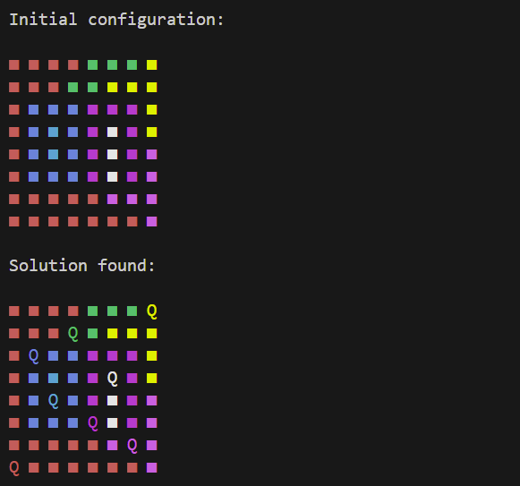

# LinkedIn Game Solver
Currently commandline based, this repo provides solvers for the daily LinkedIn games. Didn't know LinkedIn had daily games? Me neither.. 

## The Games
### Zip
[Not complete]

### Queens
Start by running `python3 solver.py --game queens`. You are then prompted to enter the board size followed by each row of the game board (the starting colors). This can be done with any 1 character code for each color. For example (1, 2, 3, ...) or (R, B, G, ...). The program then displays the entered board and solves.

### Tango
[Not complete]

### Pinpoint
[Not complete]

### Crossclimb
[Not complete]

## Future Work
- [ ] Zip initial functionality
- [ ] Tango initial functionality
- [ ] Pinpoint initial functionality
- [ ] Crossclimb initial functionality
- [ ] Improved entry of game state to program