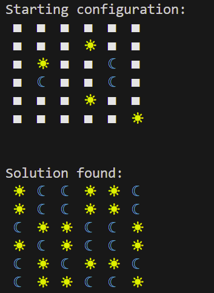

# LinkedIn Game Solver
Currently commandline based, this repo provides solvers for the daily LinkedIn games. Didn't know LinkedIn had daily games? Me neither.. 

## The Games
### Zip
[Not complete]

### Queens
Start by running `python3 solver.py --game queens`. This runs selenium script which retrieves the current game board for queens. After retrieving the puzzle the backtracking algorithm solves the loaded game board.

### Tango
Start by running `python3 solver.py --game tango`. You are then prompted to enter the starting Moons (M) and Suns (S) along with all of the rules (X or =). The expected notation is the symbol followed by the location. For rules you enter the two relevant locations. Whitespace in the notation is ignored. A grid with position notation is provided to aid in mapping the positions. The starting state is all entered in the same input. 

### Pinpoint
[Not complete]

### Crossclimb
[Not complete]

## Future Work
- [ ] Zip initial functionality
- [ ] Pinpoint initial functionality
- [ ] Crossclimb initial functionality